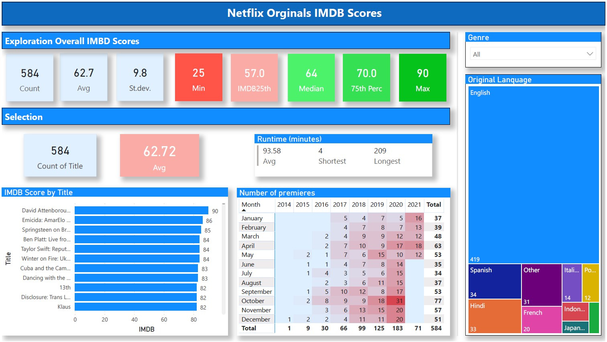

# **Netflix IMDB Scores**

## **Project Summary**
This dataset consists of all Netflix original films released as of June 1st, 2021. Additionally, it also includes all Netflix documentaries and specials. IMDB scores are voted on by community members, and the majority of the films have 1,000+ reviews.

I used Power BI to create a visualization with filter options. 

## **Key words**
* Power BI
* Dax
* Power Query
* M-language
* Dynamic Language selection
* Dynamic Conditional Formating

## **Top Row**

In the toprow the values of the dataset exploration are displayed. 
* The total number of titles in the whole dataset. 
* The overall average IMDB score. 
* The standard deviation
* The minimum and maximum 
* The quartiles of the IMDB Scores. 

These values will always display the same, despite any filter applied. They will only change when new titles with new scores are added to the dataset. 
I used the Dax function "CALCULATE" for this in combination with "REMOVEFILTERS" function. 

``` Dax
DAX
IMDB_75th = CALCULATE(PERCENTILE.EXC(NetflixOriginals[IMDB],0.75),
            REMOVEFILTERS(NetflixOriginals))
```

## **Dynamic Language selection**
On the right side, 2 filters can be applied:
* Genre
* Original language.

If in the future more titles are added to the dataset and 1 language 'moves' from the other category to a top 9 position it will automically get it's own button in the Treemap. Another less popular language will automatically be grouped in the other category.
Here is my approach:
* I added a query referencing the original dataset. 
* Added a column Count on language and ordered descending based on the count. 
* Added an index column starting at 1. 
* Next I added a conditional column called languageCategory: if the line index is <10, the line value in this new column gets the same value as the value in the language column. If not; it gets the value [other].

This way the most popular languages have their own filter buttons in the Treemap. All the rest is grouped under the [other] category button. 

## **Dynamic Conditional Formating**
Based on the filters applied, the values underneath the "Selection" header will change. The Avg IMBD score in the selection area is color coded based on the quartile range over the whole dataset. 
This way it's easily determined how the group of selected titles scores on the IMDB scores compared to all scores in the dataset. 

For this to work I created a Dax Measure called "Dynamic Color". This measure is used in the conditional background color settings of the card visualization. 
```Dax
DAX:
Dynamic Color = if(AVERAGE(NetflixOriginals[IMDB])<[IMDB25th],"#faaba5",
                if(AVERAGE(NetflixOriginals[IMDB])<[IMDB_Median],"#faaba5",
                if(AVERAGE(NetflixOriginals[IMDB])<[IMDB_75th],"#4CF269",
                if(AVERAGE(NetflixOriginals[IMDB])<[IMDB_Max],"#36E053",
                "#06C31C"))))
```


## **Outcome**


Unfortunately I don't own a Microsoft Pro license, so i'm not able to embed the dashboard. I can however share the .pbix file. 